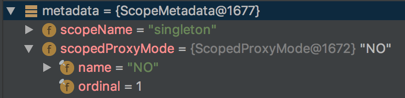
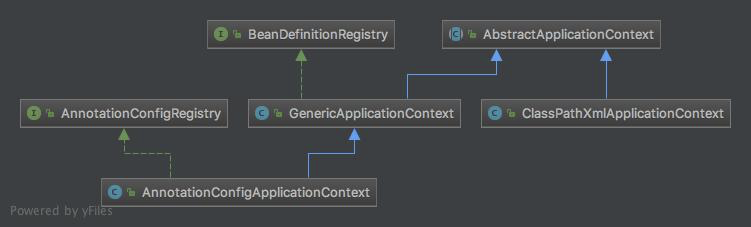

我刚进入公司的时候项目从springboot改回spring，起始的时候是用ClassPathXmlApplicationContext，我觉得配置文件的方式比较麻烦，又不是springboot那样的注解启动的主流方式，于是把启动改成了AnnotationConfigApplicationContext。

使用不是学习的目的，我决定以此为切入点深入的看一下源码的实现。

## 总览

### AnnotationConfigApplicationContext继承结构
AnnotationConfigApplicationContext和ClassPathXmlApplicationContext都是继承之AbstractApplicationContext


### 应用场景
```java
public static void main(String[] args) {
    AnnotationConfigApplicationContext context = new AnnotationConfigApplicationContext();
    context.getEnvironment().setActiveProfiles(profileName);
    context.register(XX.class);
    context.register(XX.class);
    context.scan("xx.xxxx.xx");
    context.refresh();
}
```

### AnnotationConfigApplicationContext类源码
#### 基础属性
```java
// 注解定义读取器
private final AnnotatedBeanDefinitionReader reader;

// 类定义扫描器
private final ClassPathBeanDefinitionScanner scanner;
```
这两个对象会在构造器new AnnotationConfigApplicationContext()的时候初始化，后面register()和
scan()两个方法实际上走的是这两个属性的注册和扫描功能。

#### 构造方法
创建注解容器的时候，会先执行AbstractApplicationContext类的静态代码块
```java
static {
  // Eagerly load the ContextClosedEvent class to avoid weird classloader issues
  // on application shutdown in WebLogic 8.1. (Reported by Dustin Woods.)
  // 根据名称是个容器关闭事件的监听，先跳过
  ContextClosedEvent.class.getName();
}
```

然后运行本类的构造方法
```java
// 默认构造函数 常用，也是另外两个带扫描路径或类对象的常用构造器方法会主动调用的基本构造方法
public AnnotationConfigApplicationContext() {
		this.reader = new AnnotatedBeanDefinitionReader(this);
		this.scanner = new ClassPathBeanDefinitionScanner(this);
}

public AnnotationConfigApplicationContext(DefaultListableBeanFactory beanFactory) {
	super(beanFactory);
	this.reader = new AnnotatedBeanDefinitionReader(this);
	this.scanner = new ClassPathBeanDefinitionScanner(this);
}

// 将配置类传入构造器，将bean注册到容器中
public AnnotationConfigApplicationContext(Class<?>... annotatedClasses) {
		this();
		register(annotatedClasses);
		refresh();
}

// 将需要扫描的路径传入构造器，会扫描包和包下所有类
public AnnotationConfigApplicationContext(String... basePackages) {
	this();
	scan(basePackages);
	refresh();
}

@Override
public void setEnvironment(ConfigurableEnvironment environment) {
	super.setEnvironment(environment);
	this.reader.setEnvironment(environment);
	this.scanner.setEnvironment(environment);
}

//为容器的注解Bean读取器和注解Bean扫描器设置Bean名称产生器
public void setBeanNameGenerator(BeanNameGenerator beanNameGenerator) {
  this.reader.setBeanNameGenerator(beanNameGenerator);
  this.scanner.setBeanNameGenerator(beanNameGenerator);
  getBeanFactory().registerSingleton(
      AnnotationConfigUtils.CONFIGURATION_BEAN_NAME_GENERATOR, beanNameGenerator);
}

//为容器的注解Bean读取器和注解Bean扫描器设置作用范围元信息解析器
public void setScopeMetadataResolver(ScopeMetadataResolver scopeMetadataResolver) {
  this.reader.setScopeMetadataResolver(scopeMetadataResolver);
  this.scanner.setScopeMetadataResolver(scopeMetadataResolver);
}

// 向容器注册一个或多个类，需要主动调用refresh()方法，使容器能够完全的接受新类的处理
// 可以看到构造方法中传入Class参数，会主动调用refresh()方法
public void register(Class<?>... annotatedClasses) {
  Assert.notEmpty(annotatedClasses, "At least one annotated class must be specified");
  this.reader.register(annotatedClasses);
}

// 扫描指定包路径及其子包下的注解类，需要主动调用refresh()方法，使容器能够完全的接受新类的处理
public void scan(String... basePackages) {
  Assert.notEmpty(basePackages, "At least one base package must be specified");
  this.scanner.scan(basePackages);
}
```
通过查看源码，可以发现这个类比较简单，主要就是通过组合关系，利用AnnotatedBeanDefinitionReader和ClassPathBeanDefinitionScannert提供2种处理方式：

- 直接将对象注册到容器中：

可以在初始化容器时注册；也可以在容器创建之后手动调用注册方法向容器注册，然后通过手动刷新容器，使得容器对注册的注解Bean进行处理。

- 通过扫描指定的包及其子包下的所有类：

在初始化注解容器时指定要自动扫描的路径，如果容器创建以后向给定路径动态添加了注解Bean，则需要手动调用容器扫描的方法，然后手动刷新容器，使得容器对所注册的Bean进行处理

接下去会了解这两种方式。

### AnnotatedBeanDefinitionReader类源码
register()方法基于AnnotatedBeanDefinitionReader类

#### 基础属性
```java
// 核心类 向注册表中注册BeanDefinition实例 此类会写文章去解读
private final BeanDefinitionRegistry registry;

// 这两个属性在AnnotationConfigApplicationContext类中有设置方法，暂时不再深入
private BeanNameGenerator beanNameGenerator = new AnnotationBeanNameGenerator();

private ScopeMetadataResolver scopeMetadataResolver = new AnnotationScopeMetadataResolver();

// 基于注解的一个类，条件注解用，不展开
private ConditionEvaluator conditionEvaluator;
```

#### 构造方法
```java
// 在AnnotationConfigApplicationContext调用的方法
public AnnotatedBeanDefinitionReader(BeanDefinitionRegistry registry) {
  this(registry, getOrCreateEnvironment(registry));
}

// 获取一个环境对象
private static Environment getOrCreateEnvironment(BeanDefinitionRegistry registry) {
  Assert.notNull(registry, "BeanDefinitionRegistry must not be null");
  if (registry instanceof EnvironmentCapable) {
    return ((EnvironmentCapable) registry).getEnvironment();
  }
  return new StandardEnvironment();
}

// 实际走的构造方法
public AnnotatedBeanDefinitionReader(BeanDefinitionRegistry registry, Environment environment) {
  Assert.notNull(registry, "BeanDefinitionRegistry must not be null");
  Assert.notNull(environment, "Environment must not be null");
  this.registry = registry;
  this.conditionEvaluator = new ConditionEvaluator(registry, environment, null);
  AnnotationConfigUtils.registerAnnotationConfigProcessors(this.registry);
}
```
看到代码后就知道，我们需要了解AnnotationConfigUtils.registerAnnotationConfigProcessors(this.registry);它是注册XXXBeanPostProcessor的一个方法，不是本文的重点，会后续另起篇幅介绍。接下去回到重点的register方法

#### 其它方法

##### register方法
```java
// 注册多个类
public void register(Class<?>... annotatedClasses) {
  for (Class<?> annotatedClass : annotatedClasses) {
    registerBean(annotatedClass);
  }
}

// 注册单个类
public void registerBean(Class<?> annotatedClass) {
  registerBean(annotatedClass, null, (Class<? extends Annotation>[]) null);
}

public void registerBean(Class<?> annotatedClass,
    @SuppressWarnings("unchecked") Class<? extends Annotation>... qualifiers) {

  registerBean(annotatedClass, null, qualifiers);
}

// 正真执行的方法
public void registerBean(Class<?> annotatedClass, String name,
    @SuppressWarnings("unchecked") Class<? extends Annotation>... qualifiers) {
  // 根据指定的注解Bean定义类，创建Spring容器中对注解Bean的封装的数据结构
  AnnotatedGenericBeanDefinition abd = new AnnotatedGenericBeanDefinition(annotatedClass);
  if (this.conditionEvaluator.shouldSkip(abd.getMetadata())) {
    return;
  }

  // 设置作用域 prototype|singleton
  ScopeMetadata scopeMetadata = this.scopeMetadataResolver.resolveScopeMetadata(abd);
  abd.setScope(scopeMetadata.getScopeName());
  // 为注解的bean生成名称
  String beanName = (name != null ? name : this.beanNameGenerator.generateBeanName(abd, this.registry));
  //处理注解Bean定义中的通用注解
  AnnotationConfigUtils.processCommonDefinitionAnnotations(abd);
  // @Qualifier 目前场景下传入的都为NULL，如果有这个注解会解析
  if (qualifiers != null) {
    for (Class<? extends Annotation> qualifier : qualifiers) {
      if (Primary.class == qualifier) {
        abd.setPrimary(true);
      }
      else if (Lazy.class == qualifier) {
        abd.setLazyInit(true);
      }
      else {
        abd.addQualifier(new AutowireCandidateQualifier(qualifier));
      }
    }
  }

  // 创建一个指定Bean名称的Bean定义对象，封装注解Bean定义类数据
  BeanDefinitionHolder definitionHolder = new BeanDefinitionHolder(abd, beanName);
  // 根据作用域创建代理对象
  definitionHolder = AnnotationConfigUtils.applyScopedProxyMode(scopeMetadata, definitionHolder, this.registry);
  // 向IoC容器注册注解Bean类定义对象
  BeanDefinitionReaderUtils.registerBeanDefinition(definitionHolder, this.registry);
}
```
从源码分析，注册bean定义类的基本步骤：
1. 基于注解Bean定义类创建AnnotatedGenericBeanDefinition对象
2. 使用注解元数据解析器解析注解Bean中关于作用域的配置
3. 处理Bean中的通用注解
4. 创建作用域内的代理对象
5. 向容器注册这个Bean

#### AnnotationScopeMetadataResolver的resolveScopeMetadata方法

通过resolveScopeMetadata(BeanDefinition definition)方法去获取Bean的作用域，prototype|singleton
```java
@Override
public ScopeMetadata resolveScopeMetadata(BeanDefinition definition) {
  ScopeMetadata metadata = new ScopeMetadata();
  if (definition instanceof AnnotatedBeanDefinition) {
    AnnotatedBeanDefinition annDef = (AnnotatedBeanDefinition) definition;
    // 获取@Scope注解的内容，其中注解和注解的值会以key-value形式放于map结构中
    // spring默认是singleton，即此处attributes为null
    AnnotationAttributes attributes = AnnotationConfigUtils.attributesFor(annDef.getMetadata(), this.scopeAnnotationType);
    // 当@Scope存在时
    // 将获取到的@Scope注解的值设置到要返回的对象中
    if (attributes != null) {
      // 设置作用域名称
      metadata.setScopeName(attributes.getAliasedString("value", this.scopeAnnotationType, definition.getSource()));
      ScopedProxyMode proxyMode = attributes.getEnum("proxyMode");
      if (proxyMode == null || proxyMode == ScopedProxyMode.DEFAULT) {
        proxyMode = this.defaultProxyMode;
      }
      //为返回的元数据设置proxyMode，默认情况下为NO
      metadata.setScopedProxyMode(proxyMode);
    }
  }
  // 返回解析的作用域元信息对象 代理模式为NO
  return metadata;
}
```
通过断点可以看到如下：

如果要设置代理模式的指定代理方式，可以在@Scope注解里面设置ScopedProxyMode属性，ScopedProxyMode源码如下：
```java
public enum ScopedProxyMode {

	// 默认走的是NO
	DEFAULT,

	// 用于singleton，如果是non-singleton，选择下面两个
	NO,

	// JDK 动态代理
	INTERFACES,

	/**
	 * CGLIB动态代理
	 */
	TARGET_CLASS;

}
```

#### AnnotationConfigUtils的processCommonDefinitionAnnotations方法

通过processCommonDefinitionAnnotations方法对类上面的通用注解进行处理，
```java
public static void processCommonDefinitionAnnotations(AnnotatedBeanDefinition abd) {
  processCommonDefinitionAnnotations(abd, abd.getMetadata());
}

static void processCommonDefinitionAnnotations(AnnotatedBeanDefinition abd, AnnotatedTypeMetadata metadata) {
  if (metadata.isAnnotated(Lazy.class.getName())) {
    abd.setLazyInit(attributesFor(metadata, Lazy.class).getBoolean("value"));
  }
  else if (abd.getMetadata() != metadata && abd.getMetadata().isAnnotated(Lazy.class.getName())) {
    abd.setLazyInit(attributesFor(abd.getMetadata(), Lazy.class).getBoolean("value"));
  }

  if (metadata.isAnnotated(Primary.class.getName())) {
    abd.setPrimary(true);
  }
  //如果Bean定义中有@DependsOn注解，则为该Bean设置所依赖的Bean名称，
  //容器将确保在实例化该Bean之前首先实例化所依赖的Bean
  if (metadata.isAnnotated(DependsOn.class.getName())) {
    abd.setDependsOn(attributesFor(metadata, DependsOn.class).getStringArray("value"));
  }

  if (abd instanceof AbstractBeanDefinition) {
    AbstractBeanDefinition absBd = (AbstractBeanDefinition) abd;
    if (metadata.isAnnotated(Role.class.getName())) {
      absBd.setRole(attributesFor(metadata, Role.class).getNumber("value").intValue());
    }
    if (metadata.isAnnotated(Description.class.getName())) {
      absBd.setDescription(attributesFor(metadata, Description.class).getString("value"));
    }
  }
}
```
简单的使用的情况下，这些注解都没有声明，会直接跳过IF判断

#### AnnotationConfigUtils的applyScopedProxyMode方法

根据Bean定义的作用域生成相应的代理模式
```java
static BeanDefinitionHolder applyScopedProxyMode(
    ScopeMetadata metadata, BeanDefinitionHolder definition, BeanDefinitionRegistry registry) {

  ScopedProxyMode scopedProxyMode = metadata.getScopedProxyMode();
  // 如果没有指定代理模式，直接返回类定义持有对象
  if (scopedProxyMode.equals(ScopedProxyMode.NO)) {
    return definition;
  }
  boolean proxyTargetClass = scopedProxyMode.equals(ScopedProxyMode.TARGET_CLASS);
  return ScopedProxyCreator.createScopedProxy(definition, registry, proxyTargetClass);
}
```
这段代码在平时使用的时候其实就是返回了传入的BeanDefinitionHolder对象，只有在有代理模式存在的情况下才会去创建一个代理对象，后面有切面代理的内容时会具体展开。

#### BeanDefinitionReaderUtils的registerBeanDefinition方法

```java
public static void registerBeanDefinition(
    BeanDefinitionHolder definitionHolder, BeanDefinitionRegistry registry)
    throws BeanDefinitionStoreException {

  // Register bean definition under primary name.
  String beanName = definitionHolder.getBeanName();
  registry.registerBeanDefinition(beanName, definitionHolder.getBeanDefinition());

  // Register aliases for bean name, if any.
  String[] aliases = definitionHolder.getAliases();
  if (aliases != null) {
    for (String alias : aliases) {
      registry.registerAlias(beanName, alias);
    }
  }
}
```

registry.registerBeanDefinition会执行GenericApplicationContext类的方法去注册，如下：
```java
public void registerBeanDefinition(String beanName, BeanDefinition beanDefinition)
    throws BeanDefinitionStoreException {

  this.beanFactory.registerBeanDefinition(beanName, beanDefinition);
}
```

这个方法又会执行到DefaultListableBeanFactory类的registerBeanDefinition方法，如下：
```java
public void registerBeanDefinition(String beanName, BeanDefinition beanDefinition)
    throws BeanDefinitionStoreException {

  Assert.hasText(beanName, "Bean name must not be empty");
  Assert.notNull(beanDefinition, "BeanDefinition must not be null");

  if (beanDefinition instanceof AbstractBeanDefinition) {
    try {
      ((AbstractBeanDefinition) beanDefinition).validate();
    }
    catch (BeanDefinitionValidationException ex) {
      throw new BeanDefinitionStoreException(beanDefinition.getResourceDescription(), beanName,
          "Validation of bean definition failed", ex);
    }
  }

  BeanDefinition oldBeanDefinition;

  // 判断beanDefinitionMap是否存在这个beanName
  oldBeanDefinition = this.beanDefinitionMap.get(beanName);
  // 不存在则进行处理，抛出异常或者覆盖等操作，具体另开Bean注册篇幅说明
  if (oldBeanDefinition != null) {
    if (!isAllowBeanDefinitionOverriding()) {
      throw new BeanDefinitionStoreException(beanDefinition.getResourceDescription(), beanName,
          "Cannot register bean definition [" + beanDefinition + "] for bean '" + beanName +
          "': There is already [" + oldBeanDefinition + "] bound.");
    }
    else if (oldBeanDefinition.getRole() < beanDefinition.getRole()) {
      // e.g. was ROLE_APPLICATION, now overriding with ROLE_SUPPORT or ROLE_INFRASTRUCTURE
      if (this.logger.isWarnEnabled()) {
        this.logger.warn("Overriding user-defined bean definition for bean '" + beanName +
            "' with a framework-generated bean definition: replacing [" +
            oldBeanDefinition + "] with [" + beanDefinition + "]");
      }
    }
    else if (!beanDefinition.equals(oldBeanDefinition)) {
      if (this.logger.isInfoEnabled()) {
        this.logger.info("Overriding bean definition for bean '" + beanName +
            "' with a different definition: replacing [" + oldBeanDefinition +
            "] with [" + beanDefinition + "]");
      }
    }
    else {
      if (this.logger.isDebugEnabled()) {
        this.logger.debug("Overriding bean definition for bean '" + beanName +
            "' with an equivalent definition: replacing [" + oldBeanDefinition +
            "] with [" + beanDefinition + "]");
      }
    }
    this.beanDefinitionMap.put(beanName, beanDefinition);
  }
  else {
    // 如果已经开始创建
    if (hasBeanCreationStarted()) {
      // Cannot modify startup-time collection elements anymore (for stable iteration)
      synchronized (this.beanDefinitionMap) {
        this.beanDefinitionMap.put(beanName, beanDefinition);
        List<String> updatedDefinitions = new ArrayList<String>(this.beanDefinitionNames.size() + 1);
        updatedDefinitions.addAll(this.beanDefinitionNames);
        updatedDefinitions.add(beanName);
        this.beanDefinitionNames = updatedDefinitions;
        if (this.manualSingletonNames.contains(beanName)) {
          Set<String> updatedSingletons = new LinkedHashSet<String>(this.manualSingletonNames);
          updatedSingletons.remove(beanName);
          this.manualSingletonNames = updatedSingletons;
        }
      }
    }
    else {
      // Still in startup registration phase
      this.beanDefinitionMap.put(beanName, beanDefinition);
      this.beanDefinitionNames.add(beanName);
      this.manualSingletonNames.remove(beanName);
    }
    this.frozenBeanDefinitionNames = null;
  }

  if (oldBeanDefinition != null || containsSingleton(beanName)) {
    resetBeanDefinition(beanName);
  }
}
```
将Bean注册到容器中实际就是放入DefaultListableBeanFactory的属性
```
private final Map<String, BeanDefinition> beanDefinitionMap = new ConcurrentHashMap<String, BeanDefinition>(256);
```
整个过程会在后续篇幅展开。

### ClassPathBeanDefinitionScanner类源码

#### 基础属性
```java
// 核心类 向注册表中注册BeanDefinition实例 此类会写文章去解读
private final BeanDefinitionRegistry registry;

// 这两个属性在AnnotationConfigApplicationContext类中有设置方法，暂时不再深入
private BeanDefinitionDefaults beanDefinitionDefaults = new BeanDefinitionDefaults();

private String[] autowireCandidatePatterns;

private BeanNameGenerator beanNameGenerator = new AnnotationBeanNameGenerator();

private ScopeMetadataResolver scopeMetadataResolver = new AnnotationScopeMetadataResolver();

private boolean includeAnnotationConfig = true;
```

#### 构造方法

```java
// 例子中使用的构造方法
public ClassPathBeanDefinitionScanner(BeanDefinitionRegistry registry) {
  this(registry, true);
}

// Spring默认扫描配置：@Component、@Repository、@Service、@Controller
//在ClassPathScanningCandidateComponentProvider中有说明，判断是否是Component
public ClassPathBeanDefinitionScanner(BeanDefinitionRegistry registry, boolean useDefaultFilters) {
  this(registry, useDefaultFilters, getOrCreateEnvironment(registry));
}

public ClassPathBeanDefinitionScanner(BeanDefinitionRegistry registry, boolean useDefaultFilters, Environment environment) {
  // 调用父类的方法去配置默认的注解识别filter
  super(useDefaultFilters, environment);

  Assert.notNull(registry, "BeanDefinitionRegistry must not be null");
  this.registry = registry;

  //如果注册器是资源加载器，则为容器设置资源加载器
  if (this.registry instanceof ResourceLoader) {
    setResourceLoader((ResourceLoader) this.registry);
  }
}
```

#### 其它方法

##### scan方法

```java
public int scan(String... basePackages) {
  // 获取容器中已经注册的Bean个数
  int beanCountAtScanStart = this.registry.getBeanDefinitionCount();

  // 扫描
  doScan(basePackages);

  // 注册注解配置(Annotation config)处理器
  if (this.includeAnnotationConfig) {
    AnnotationConfigUtils.registerAnnotationConfigProcessors(this.registry);
  }

  // 返回注册的Bean个数
  return (this.registry.getBeanDefinitionCount() - beanCountAtScanStart);
}

protected Set<BeanDefinitionHolder> doScan(String... basePackages) {
  Assert.notEmpty(basePackages, "At least one base package must be specified");
  // 创建一个集合，存放扫描到Bean定义的封装类
  Set<BeanDefinitionHolder> beanDefinitions = new LinkedHashSet<BeanDefinitionHolder>();
  // 遍历扫描所有给定的包
  for (String basePackage : basePackages) {
    // 通过父类方法findCandidateComponents扫描给定类路径，获取符合条件的Bean定义
    Set<BeanDefinition> candidates = findCandidateComponents(basePackage);
    // 遍历扫描到的Bean
    for (BeanDefinition candidate : candidates) {
      ScopeMetadata scopeMetadata = this.scopeMetadataResolver.resolveScopeMetadata(candidate);
      candidate.setScope(scopeMetadata.getScopeName());
      String beanName = this.beanNameGenerator.generateBeanName(candidate, this.registry);
      // 进行AbstractBeanDefinition属性默认设置
      if (candidate instanceof AbstractBeanDefinition) {
        postProcessBeanDefinition((AbstractBeanDefinition) candidate, beanName);
      }
      //
      if (candidate instanceof AnnotatedBeanDefinition) {
        AnnotationConfigUtils.processCommonDefinitionAnnotations((AnnotatedBeanDefinition) candidate);
      }
      // 根据Bean名称检查指定的Bean是否需要在容器中注册
      // 执行方法在register中已经涉及，故不再扩展说明
      if (checkCandidate(beanName, candidate)) {
        BeanDefinitionHolder definitionHolder = new BeanDefinitionHolder(candidate, beanName);
        definitionHolder = AnnotationConfigUtils.applyScopedProxyMode(scopeMetadata, definitionHolder, this.registry);
        beanDefinitions.add(definitionHolder);
        registerBeanDefinition(definitionHolder, this.registry);
      }
    }
  }
  return beanDefinitions;
}
```
此文结合实际使用场景，对源码进行一定的了解。

